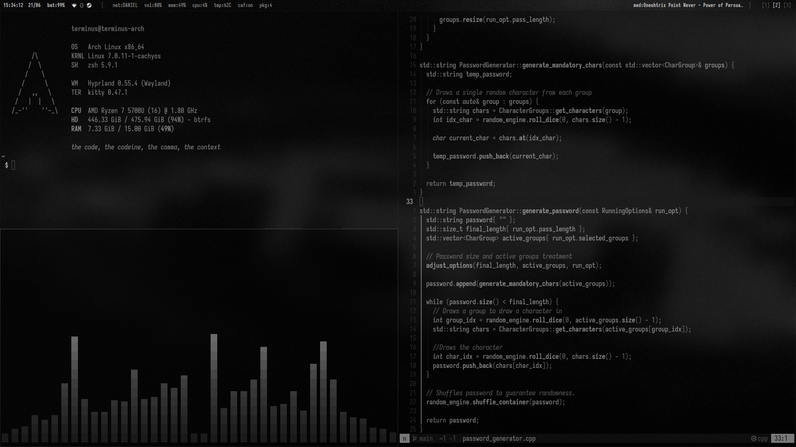
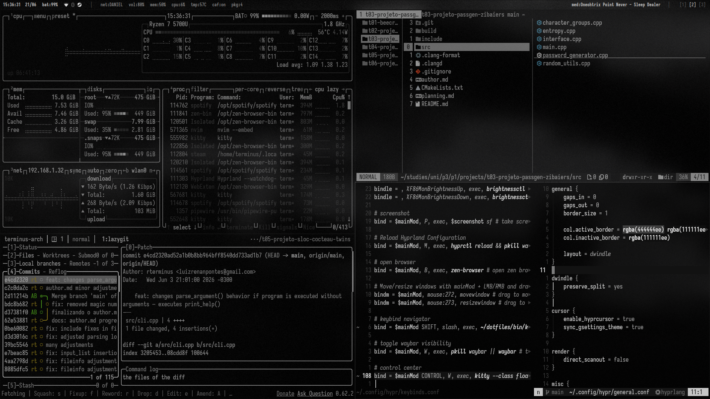

# rterminus dotfiles

a keyboard-driven, minimalistic, and monochromatic wayland rice.
crafted for raw productivity, zero distractions, and seamless terminal workflow.



## anatomy

the core components that make up this environment:

- **eye**: hyprland && neovim
- **soul**: arch linux && zsh
- **hand**: kitty && tmux

## workflow showcase



## highlights

- **hyprland:** strict tiling rules with specific floating exceptions for quick tasks.
  window movements bound to `mod + shift + hjkl`.
- **kitty:** monochromatic elegance. 100% solid opacity when focused for reading code,
  60% transparent when inactive to blend with the wallpaper.
- **starship:** simple and minimal prompt for highlighting only relevant information.
- **system:** heavily optimized for amd hardware rendering.
- **other**: unified stylization for launcher and notif daemon.

## installation

clone the repository and symlink the configurations to your `~/.config` directory.

```bash
git clone https://github.com/rterminus/dotfiles.git ~/dotfiles
cd ~/dotfiles
```
