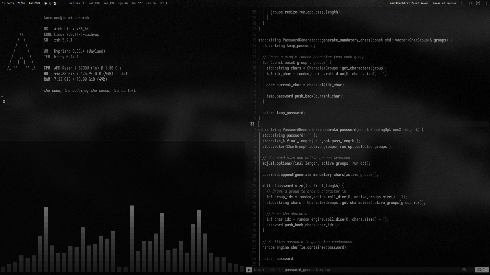
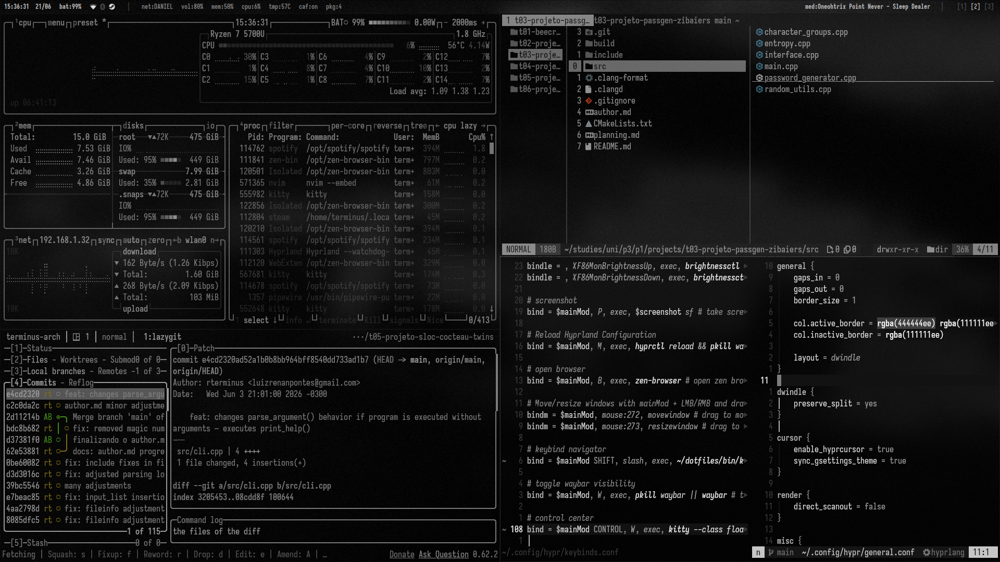

# rterminus dotfiles

a keyboard-driven, minimal and monochromatic hyprland setup.
everything lives in the terminal — no fluff, just focus.



## what's inside

- **hypr** — Wayland compositor (Hyprland)
- **kitty** — GPU-accelerated terminal
- **zsh** — shell with fast plugin management
- **nvim** — Neovim, tuned for code and prose
- **tmux** — terminal multiplexer, session persistence
- **rofi** — app launcher, window switcher, power menu
- waybar — status bar
- dunst — notification daemon
- yazi — terminal file manager
- bin — handful of utility scripts

everything shares a single, coherent aesthetic and is controlled almost entirely
by the keyboard.



## highlights

- **unified theme** — all apps follow the same monochrome palette
- **keyboard-first** — every action has a shortcut; the mouse is optional
- **glassmorphism** — subtle blur and transparency where it makes sense
- **portable** — managed with GNU Stow, symlink in one command

## installation

### prerequisites

arch linux (or any arch-based distro), git, and gnu stow. the configs assume you
already have the required programs installed (hyprland, kitty, etc.).

```bash
git clone https://github.com/yourusername/dotfiles.git ~/dotfiles
cd ~/dotfiles
stow */ # symlinks everything except the assets folder
```

`*/` will pick up all top-level directories and place their contents relative to
`$HOME`.  
If you prefer to pick and choose, just stow individual packages:

```bash
stow hypr kitty nvim waybar ...
```

post-install

Most components will pick up the new configs immediately. For Hyprland, log out
and back in (or reload). For Zsh, open a new terminal or source ~/.zshrc.
